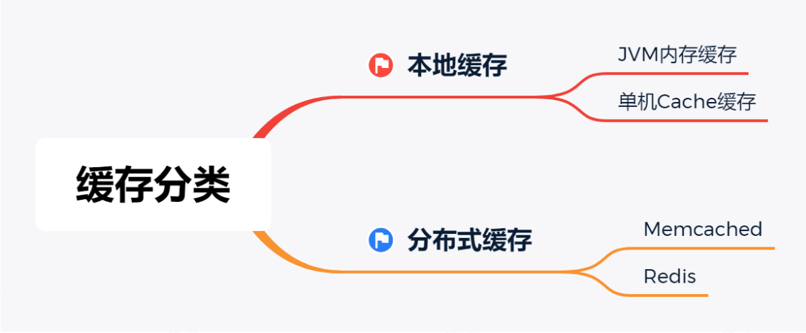
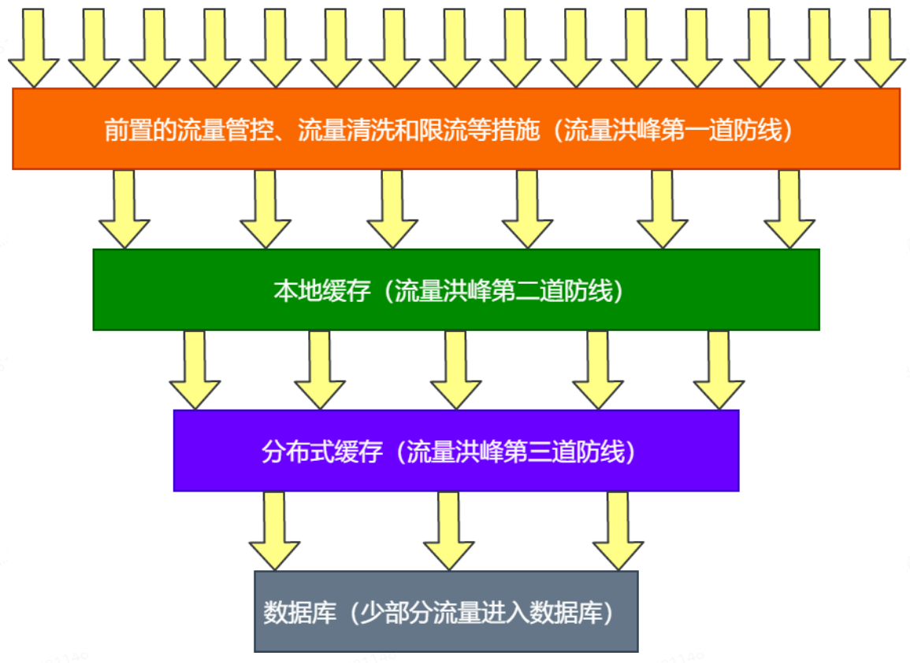
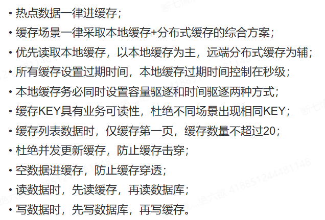
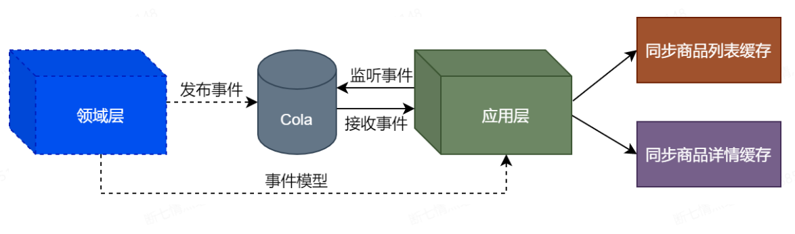
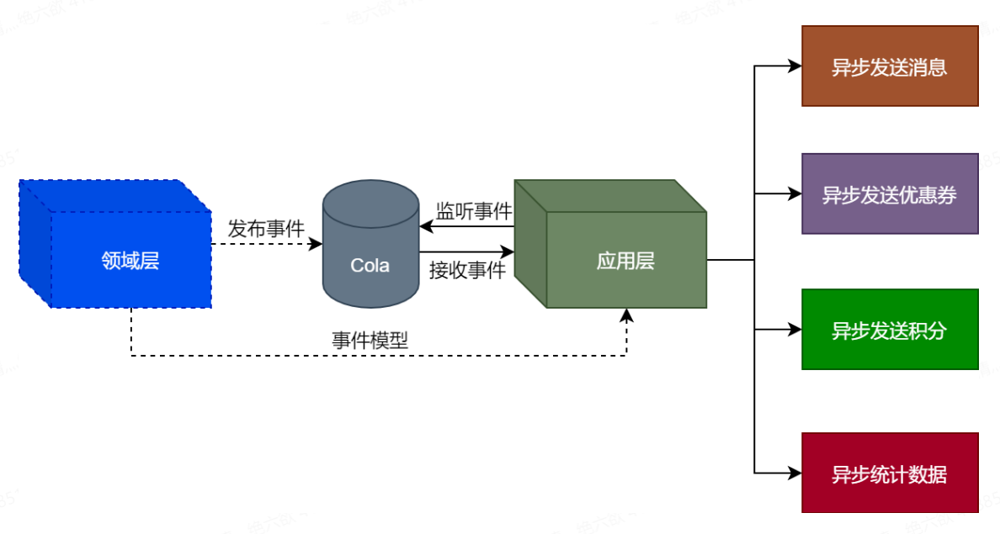
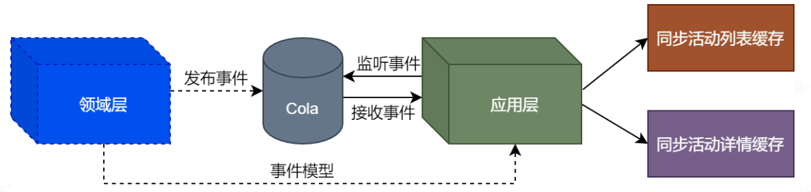

### 缓存分类

### 抗流量洪峰

### 缓存设计注意事项

### 领域事件发布流程

- **商品领域事件流程**

  

- **订单领域事件流程**

  

- **活动领域事件流程**

  

### 秒杀扣减库存设计方案

#### 恶意下单问题解决方案

1. **用户行为标签**：为频繁下单却未支付的用户打标签，这类用户下单时执行特殊逻辑，如暂不扣减库存。
2. **限购策略**：为秒杀商品设定单用户购买上限，如每人最多2件，限制可基于用户ID、手机号、收货地址或IP等。
3. **地域限制**：针对特定区域（如北上广深）投放商品，仅允许这些地区的用户参与，各区域库存独立管理。
4. **重复下单控制**：下单前检查用户是否有未支付的同商品订单，存在则提示先完成支付。

#### 库存超卖问题解决方案

1. **普通商品补货机制**：非秒杀场景下，若下单量超过库存，可通过补货应对。
2. **库存不足提示**：用户下单时立即反馈库存状态，避免无效操作。

#### 防止库存变为负数的措施

1. **前置检查**：扣减库存前，确保商品剩余库存大于购买数量，否则返回库存不足信息。
2. **事务回滚**：在事务中扣减库存后，检测库存是否变为负值，若为负则事务回滚。
3. **数据库约束**：将数据库中的库存字段设为无符号整数，从根本上阻止库存出现负数。