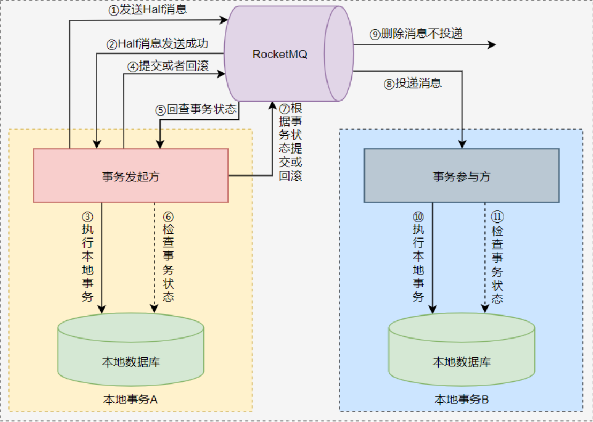
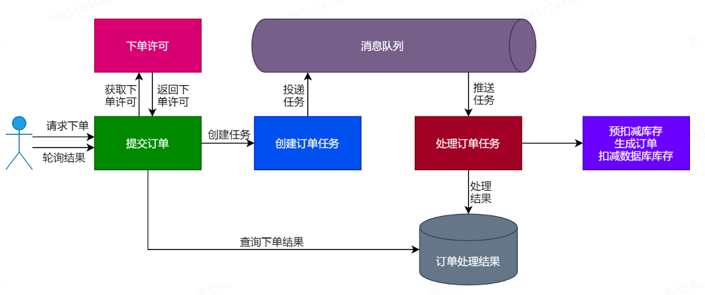
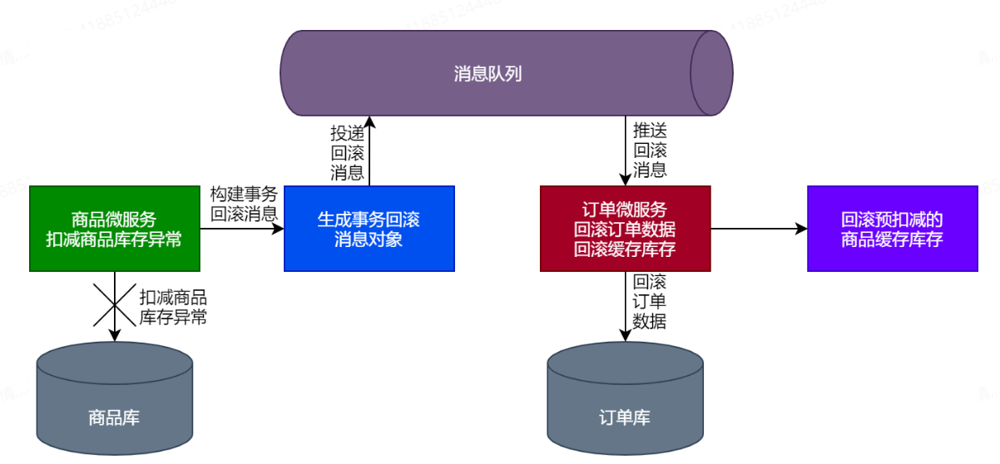

### 缓存分类

### 抗流量洪峰

### 缓存设计注意事项

### 领域事件发布流程

- **商品领域事件流程**

  

- **订单领域事件流程**

  

- **活动领域事件流程**

  

### 秒杀扣减库存设计方案

#### 恶意下单问题解决方案

1. **用户行为标签**：为频繁下单却未支付的用户打标签，这类用户下单时执行特殊逻辑，如暂不扣减库存。
2. **限购策略**：为秒杀商品设定单用户购买上限，如每人最多2件，限制可基于用户ID、手机号、收货地址或IP等。
3. **地域限制**：针对特定区域（如北上广深）投放商品，仅允许这些地区的用户参与，各区域库存独立管理。
4. **重复下单控制**：下单前检查用户是否有未支付的同商品订单，存在则提示先完成支付。

#### 库存超卖问题解决方案

1. **普通商品补货机制**：非秒杀场景下，若下单量超过库存，可通过补货应对。
2. **库存不足提示**：用户下单时立即反馈库存状态，避免无效操作。

#### 防止库存变为负数的措施

1. **前置检查**：扣减库存前，确保商品剩余库存大于购买数量，否则返回库存不足信息。
2. **事务回滚**：在事务中扣减库存后，检测库存是否变为负值，若为负则事务回滚。
3. **数据库约束**：将数据库中的库存字段设为无符号整数，从根本上阻止库存出现负数。

### 单体架构

#### 优点
- **架构简洁明了**：设计简单直接，减少了复杂性带来的理解与实施难度。
- **低成本开发与维护**：对于小型项目而言，所有模块集中开发和部署，能有效降低初期的资源消耗和运维成本。

#### 缺点
- **高耦合性**：随着项目规模增长，模块间紧密耦合，修改一处可能引发多处变动，增加维护负担。
- **扩展与维护困难**：大型项目难以通过局部优化提升整体性能，且单一模块故障可能导致整个系统瘫痪。
- **性能瓶颈明显**：无法针对高负载模块单独进行性能升级。
- **扩展受限**：水平扩展能力有限，难以适应快速增长的用户需求。

### 微服务架构

#### 优点
- **服务解耦**：每个服务职责单一，易于独立开发、部署和升级，提高了系统的灵活性和可维护性。
- **清晰的业务边界**：便于团队聚焦特定业务领域，促进服务的持续迭代和扩展。
- **灵活的通信方式**：服务间可通过RESTful API、gRPC等轻量级通信协议交互，增强系统间的松耦合性。

#### 缺点
- **较高的开发与运维成本**：需要处理服务拆分、服务间通信、服务治理等问题。
- **容错与故障隔离**：需要实现复杂的服务发现、负载均衡、断路器等机制来保证系统的稳定性和容错能力。
- **数据一致性挑战**：跨服务的数据交互可能导致数据一致性问题，需引入分布式事务或事件驱动等解决方案。
- **分布式复杂度**：分布式系统固有的问题，如网络延迟、服务间依赖管理等，增加了开发和运维的复杂度。

### 下单总体流程

### 可靠消息最终一致性分布式事务解决方案分类

可靠消息最终一致性模型主要分为三类：本地消息表、独立消息服务、事务消息。以下是基于RocketMQ实现事务消息的流程概览：

### 流程详述

1. **Half消息发送**：事务发起方向RocketMQ发送一个Half消息（预提交消息）。
2. **确认发送**：RocketMQ确认Half消息发送成功。
3. **执行本地事务**：事务发起方在本地数据库执行相应的事务操作。
4. **提交/回滚决策**：事务发起方根据本地事务执行结果，向RocketMQ发送Commit或Rollback指令。
5. **事务状态检查**：如果事务参与方未收到消息，或者执行事务失败，RocketMQ未删除保存的消息数据时,若RocketMQ未收到明确的Commit/Rollback指令，将主动查询事务发起方的事务状态。
6. **查询本地状态**：事务发起方查询本地数据库，确认事务执行的实际状态。
7. **最终决策通知**：根据查询结果，事务发起方向RocketMQ发送最终的Commit或Rollback消息。
8. **消息投递**：RocketMQ根据Commit消息向事务参与方投递业务消息，
9. **消息删除**：在Rollback情况下不投递并清理消息。
10. **执行本地事务**：如果RocketMQ向事务参与方投递的是执行本地事务的消息，则事务参与方会执行本地事务，向本地数据库中插入/更新/删除数据
11. **查询本地事务**：如果RocketMQ想事务参与方投递的是查询本地事务状态的消息，则事务参与方会查询本地数据库中事务的执行状态

在使用RocketMQ实现分布式事务时，上述流程中的主要部分都由RocketMQ自动实现了，开发人员只需要实现本地事务的执行逻辑和本地事务的回查方法，重点关注事务的执行状态即可。

#### 异步下单具体流程设计

#### 事务消息的逆向流程

1. **检测到扣减库存失败**
  - 商品微服务在尝试扣减库存时遇到错误（如库存不足、系统异常等），触发事务补偿逻辑。

2. **生成事务回滚消息**
  - 构建一条包含原订单信息及回滚原因的事务回滚消息，用于指示需要恢复之前的操作。

3. **发送回滚消息至队列**
  - 将事务回滚消息投递到消息队列，确保其能够被正确处理而不立即影响主流程。

4. **订单服务监听并处理回滚消息**
  - 订单服务订阅了事务回滚消息队列，一旦接收到回滚消息，即开始执行回滚操作。

5. **执行订单数据回滚**
  - 删除或更新订单记录，使其状态回到下单前的状态，确保数据一致性。

6. **预扣减商品缓存库存回滚**
  - 如果之前有预扣减商品的缓存库存，同步更新缓存，释放预占资源。

7. **记录与通知**
  - 记录回滚操作日志，并可根据业务需求通知相关方（如用户、客服团队）关于订单变更的信息。

